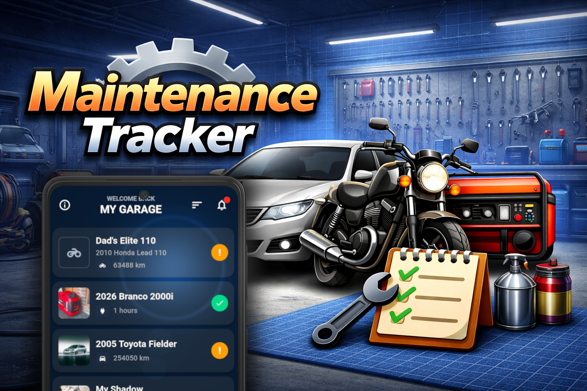
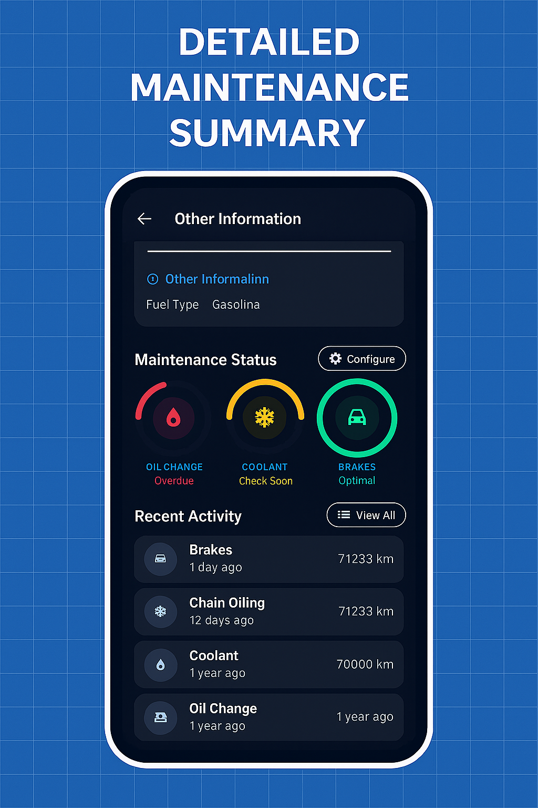
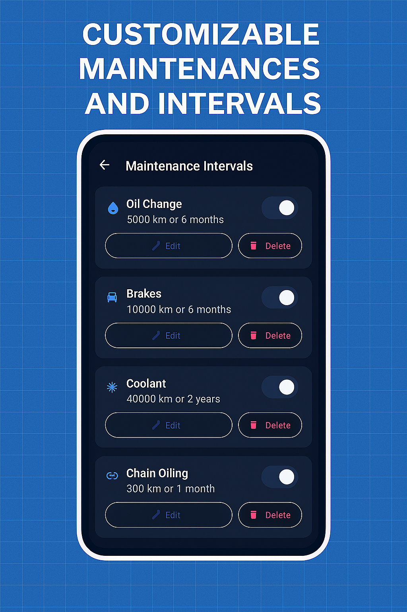
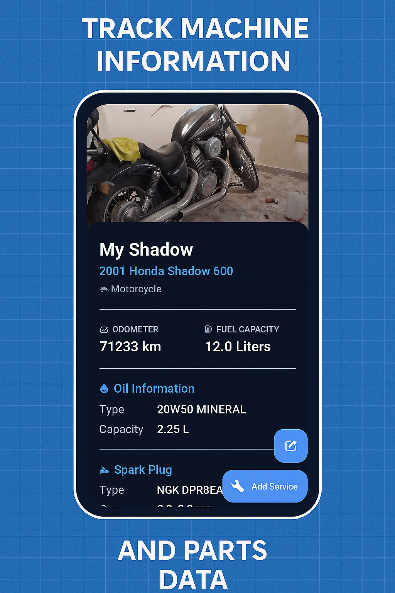
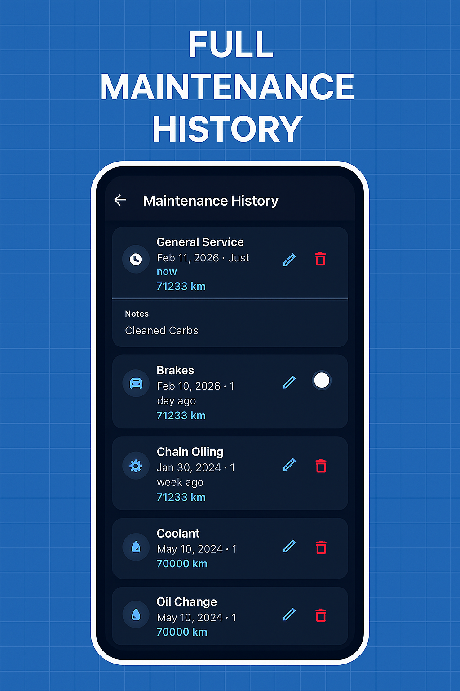
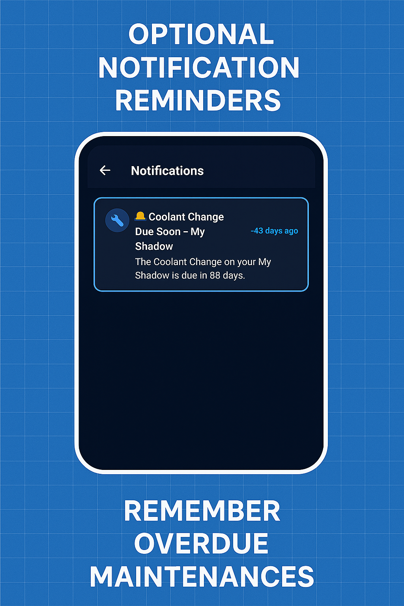
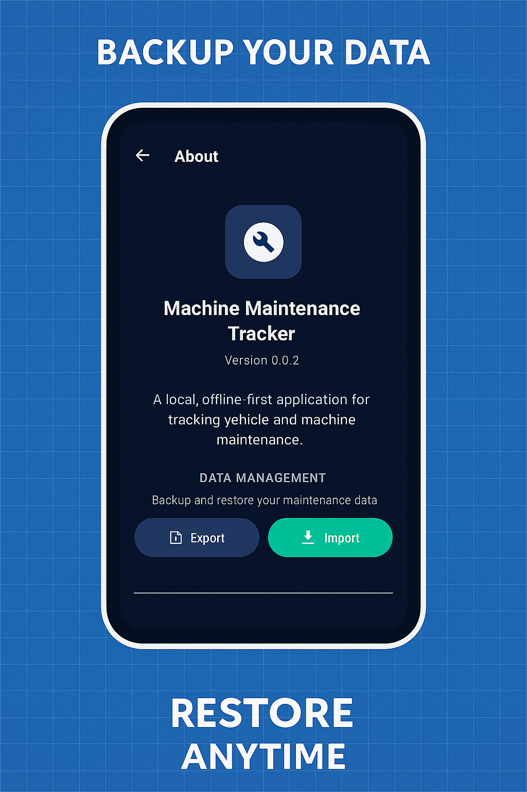

<div align="center">
  
  
  <h1>Machine Maintenance Tracker</h1>
  <p><strong>Never miss a service again. Keep your machines running smoothly.</strong></p>
  
  <a href="https://play.google.com/store/apps/details?id=com.machinemaintenance.machine_maintenance">
    
  </a>
  
  <br><br>
  
  
  
  
</div>

---

## ✨ Why Machine Maintenance Tracker?

Your vehicles and machines are investments. Whether it's your motorcycle, car, generator, or industrial equipment, proper maintenance keeps them reliable and extends their lifespan. **Machine Maintenance Tracker** makes it effortless to stay on top of every service, repair, and inspection.

### 🎯 Built for You

- **100% Private** - All your data stays on your device. No accounts, no cloud, no tracking.
- **Smart Reminders** - Get notified when maintenance is due, based on time or mileage.
- **Complete History** - Log every service with photos, notes, and costs.
- **Multiple Machines** - Track all your vehicles and equipment in one place.
- **Works Offline** - No internet connection required. Ever.

---

## 📱 Screenshots

<div align="center">
  
  
  
</div>

<div align="center">
  
  
  
</div>

---

## 🚀 Key Features

<table>
  <tr>
    <td width="50%">
      <h3>🔧 Track Everything</h3>
      <p>Motorcycles, cars, generators, industrial machines—if it needs maintenance, track it here. Add photos, specifications, and custom details for each machine.</p>
    </td>
    <td width="50%">
      <h3>⏰ Smart Reminders</h3>
      <p>Set maintenance intervals by time (days) or usage (kilometers/hours). The app monitors your machines and alerts you when service is due.</p>
    </td>
  </tr>
  <tr>
    <td width="50%">
      <h3>📊 Visual Status</h3>
      <p>See at a glance which machines need attention. Color-coded indicators show optimal, approaching, or overdue maintenance status.</p>
    </td>
    <td width="50%">
      <h3>📝 Complete Records</h3>
      <p>Log oil changes, filter replacements, inspections, fuel fills—everything. Add costs, notes, and odometer readings for comprehensive tracking.</p>
    </td>
  </tr>
  <tr>
    <td width="50%">
      <h3>🔒 Privacy First</h3>
      <p>Your data never leaves your device. No accounts, no servers, no cloud sync. Export and import your data anytime.</p>
    </td>
    <td width="50%">
      <h3>🌙 Beautiful Design</h3>
      <p>Modern dark theme optimized for easy reading. Clean interface that puts your machines front and center.</p>
    </td>
  </tr>
</table>

---

## 🛠️ Maintenance Types Supported

- **Oil Changes** - Track oil type, capacity, and change intervals
- **Filter Service** - Air filters, oil filters, fuel filters
- **Tire Maintenance** - Track front and rear tire sizes and replacements
- **Brake System** - Fluid changes, pad replacements, inspections
- **Coolant Service** - Track coolant type and change intervals
- **Spark Plugs** - Monitor spark plug type and replacement
- **Chain/Belt Service** - Lubrication and replacement tracking
- **General Service** - Comprehensive service and inspections
- **Fuel Logging** - Track fuel consumption and costs
- **Custom Types** - Add any maintenance type you need

---

## 📥 Getting Started

### For Users

<a href="https://play.google.com/store/apps/details?id=com.machinemaintenance.machine_maintenance">
  
</a>

Download from Google Play Store and start tracking your machines in minutes.

### For Developers

This is an open-source Flutter project. Contributions are welcome!

```bash
# Clone the repository
git clone https://github.com/yourusername/machine-maintenance-android.git

# Install dependencies
flutter pub get

# Run the app
flutter run
```

**Requirements:** Flutter 3.38.9+, Dart 3.10.8+

---

## 🤝 Contributing

We welcome contributions! Whether it's bug reports, feature requests, or code contributions, your input helps make this app better for everyone.

1. Fork the repository
2. Create your feature branch (`git checkout -b feature/AmazingFeature`)
3. Commit your changes (`git commit -m 'Add some AmazingFeature'`)
4. Push to the branch (`git push origin feature/AmazingFeature`)
5. Open a Pull Request

---

## 📄 License

Private project - All rights reserved

---

## 💬 Support

Found a bug? Have a feature request? [Open an issue](../../issues) on GitHub.

---

<div align="center">
  <p>Made with ❤️ for people who care about their machines</p>
  <p>
    <a href="https://play.google.com/store/apps/details?id=com.machinemaintenance.machine_maintenance">Download Now</a> •
    <a href="../../issues">Report Bug</a> •
    <a href="../../issues">Request Feature</a>
  </p>
</div>
